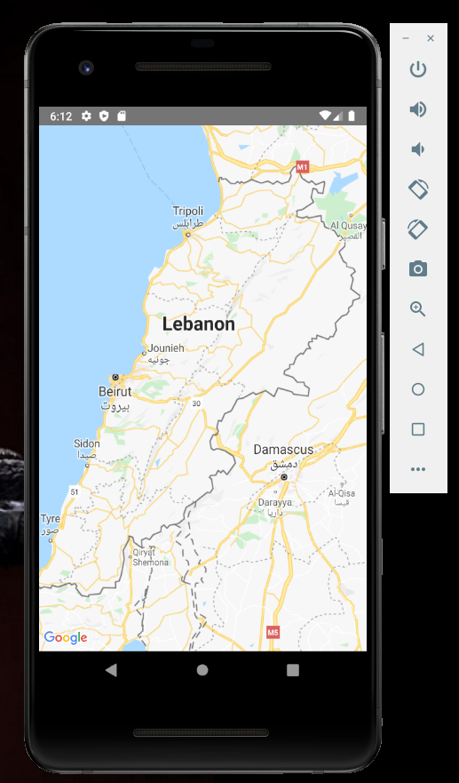
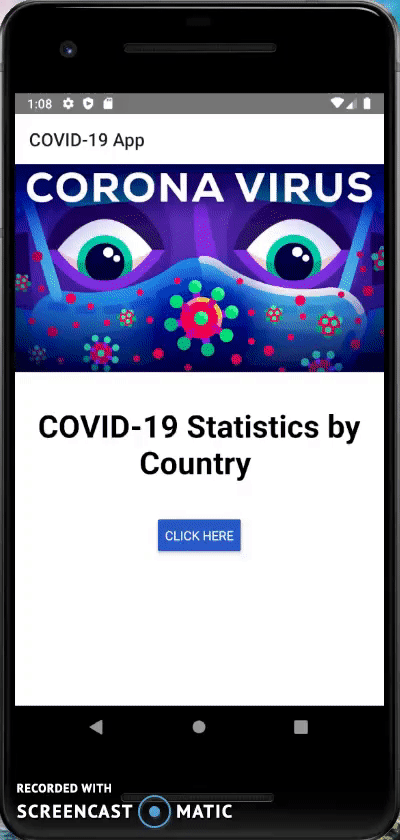

# Covid-19 App
codvid-app-nadimelhelou created by GitHub Classroom

## Progress Tracking
### Steps 1-3: Setup REACT Native Environment, Go through REACT native Tutorial, Develop use case to display a map
Deployed on an Android Virtual Device.

### Step 4: Exercise the CODVID-19 API and display the data in your application as text
Deployed on an Android Virtual Device.

