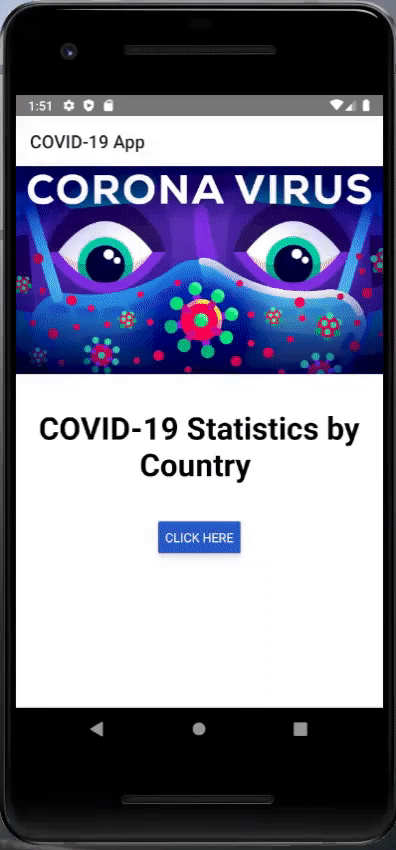

# Covid-19 App
codvid-app-nadimelhelou created by GitHub Classroom

## Running
Don't forget to add your own Google API key [here](https://github.com/BUEC500C1/codvid-app-nadimelhelou/blob/master/5.%20COVID-19%20Map%20App/android/app/src/main/AndroidManifest.xml#L28) (the current one has been deactivated).

## Progress Tracking
### Steps 1-3: Setup REACT Native Environment, Go through REACT native Tutorial, Develop use case to display a map
Deployed on an Android Virtual Device.

### Step 4: Exercise the CODVID-19 API and display the data in your application as text
Deployed on an Android Virtual Device.

### Step 5: Overlay the data on the maps
Here is the final app which shows all the statistics on a map

